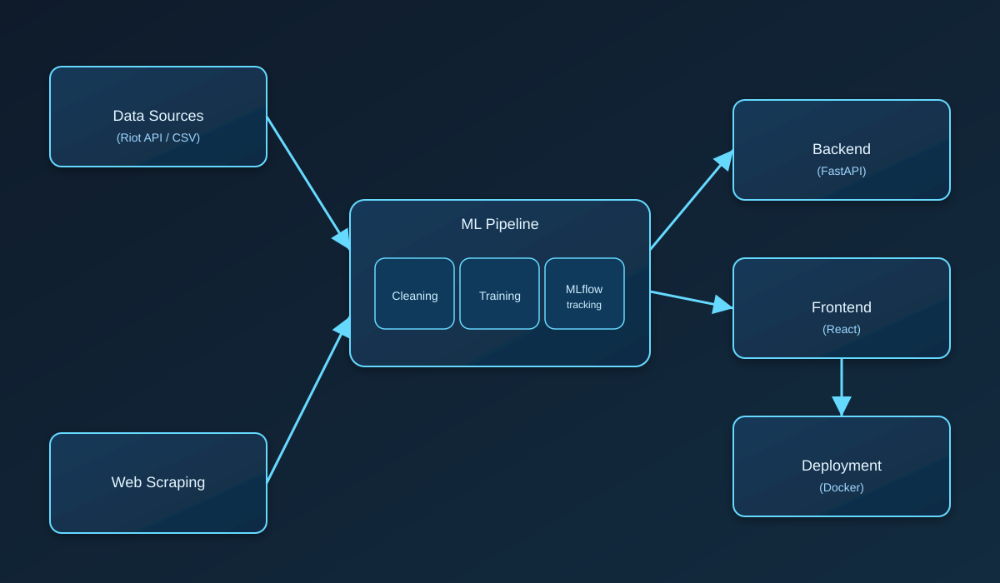

# Riot Games Project

End-to-end machine learning platform for League of Legends analytics with a FastAPI backend, React frontend, Riot API integration, and MLflow experiment tracking.



## Group Members
- Khalil Ayeb
- Melek Bouabid

## Objective
Build and evaluate machine-learning models using Riot API match data to predict:
- match outcomes
- player rank tier
- smurf anomalies
- rank progression

while identifying which gameplay features most influence these predictions.

## Data Schema
See `data/processed/README.md` for the updated feature dataset schema.

## Progress Summary (Feb 27, 2026)

### ✅ What We Achieved
- Trained and integrated 4 core prediction modules:
  - Rank Tier Classification
  - Progression Regression
  - Smurf Anomaly Detection
  - Match Outcome Prediction (multiple variants)
- Built a production-style API layer with FastAPI (`/api/v1`).
- Connected frontend pages to live backend endpoints.
- Added Riot API resilience features (cache + retry/backoff + health status mapping).
- Added UI/UX improvements: skeleton loading, retry cooldown, status badges, cache age and timestamps.

## MLflow

### Current Setup
- MLflow is used to track experiments, metrics, artifacts, and model runs.
- Local tracking data is stored under `mlruns/` and artifacts under `mlartifacts/`.
- Setup and comparison scripts are available in `scripts/3_model_training/`.

### Run MLflow UI
```bash
mlflow ui --port 5000
```
Open: `http://127.0.0.1:5000`

### MLflow Scripts
- `scripts/3_model_training/mlflow_setup.py` → initialize experiments
- `scripts/3_model_training/train_all_models.py` → train models with tracking
- `scripts/3_model_training/mlflow_model_comparison.py` → compare runs

## Model Choice

### Selected Model Families
- **Rank Tier Classifier**
  - Predicts rank tier from player performance features.
- **Progression Regressor**
  - Predicts win-rate/skill progression tendency.
- **Smurf Detector**
  - Anomaly-based detector for suspiciously high-skill behavior.
- **Match Outcome Predictor**
  - Supports `early`, `full`, `strict`, and `cascade` variants.

### Why This Choice
- Covers classification + regression + anomaly detection for complete player analysis.
- Enables both offline evaluation and live API inference.
- Match outcome variants support different feature availability windows.

## FastAPI Setup

### Environment
- Python dependencies: `requirements.txt`
- Settings source: environment variables in `.env`
- Main app entry: `api/main.py`
- Config object: `api/core/settings.py`

### Start Backend
```bash
.venv\Scripts\python.exe -m uvicorn api.main:app --host 127.0.0.1 --port 8001
```

### API Base
- Base URL: `http://127.0.0.1:8001`
- Prefix: `/api/v1`
- Docs: `/docs`
- OpenAPI JSON: `/openapi.json`

## Endpoint Implementation

### Health
- `GET /api/v1/health`
- `GET /api/v1/health/riot`

### Match Outcome
- `GET /api/v1/match-outcome/models`
- `POST /api/v1/match-outcome/predict/early`
- `POST /api/v1/match-outcome/predict/full`
- `POST /api/v1/match-outcome/predict/cascade`
- `POST /api/v1/match-outcome/predict/strict`

### Other ML Endpoints
- `POST /api/v1/rank/predict`
- `POST /api/v1/progression/predict`
- `POST /api/v1/smurf/predict`
- `POST /api/v1/summoner/predict`

### Riot Resilience Implemented
- Response cache for summoner prediction endpoint.
- Retry with exponential backoff for transient Riot failures.
- Health mapping for key states (active / expired / rate-limited / unreachable).

## Swagger Testing

### How to Test in Swagger
1. Start backend server.
2. Open `http://127.0.0.1:8001/docs`.
3. Expand an endpoint (for example `POST /api/v1/rank/predict`).
4. Click **Try it out**.
5. Paste a valid JSON payload.
6. Click **Execute** and inspect response + status code.

### Recommended Quick Checks
- `GET /api/v1/health`
- `GET /api/v1/match-outcome/models`
- `POST /api/v1/summoner/predict` (requires valid Riot API key)

## Frontend

### Stack
- React + TypeScript + Vite
- Routing with React Router
- Charts/visualization with Recharts

### Start Frontend
```bash
cd "frontend/hextech-insights (1)"
npm install
npm run dev
```
Open: `http://127.0.0.1:5173`

### Recent Frontend Improvements
- Removed duplicate summoner search UI in Live Analytics flow.
- Added model-card navigation from Model Dashboard to Predictions page.
- Added a compare-players page with side-by-side metrics.
- Added “Why This Prediction” explainability cards.
- Added loading skeletons, retry cooldown, empty states, Riot status badge, and update timestamps.

## Frontend-Backend Integration

### Integration Status
- Frontend API client is centralized in `frontend/hextech-insights (1)/services/api.ts`.
- Uses `VITE_API_BASE_URL` (default: `http://127.0.0.1:8001/api/v1`).
- Predictions and profile flows are linked to backend endpoints and typed responses.

### Data Flow
1. User action from frontend page.
2. Frontend calls FastAPI endpoint.
3. Backend loads model/service and returns prediction payload.
4. Frontend renders metrics, charts, explanations, and status indicators.

## Next Priority
- Replace expired Riot dev key with active key to fully validate live summoner pipeline end-to-end without fallback mode.
- Add Docker Compose for one-command startup (backend + frontend + MLflow).
